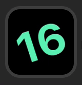

# Stream Deck plugin examples

This repo contains examples for using the Go
[Stream Deck plugin library](https://github.com/tardisx/streamdeck-plugin)

## SpinClock

A minimalist clock. [Link](spinclock).

